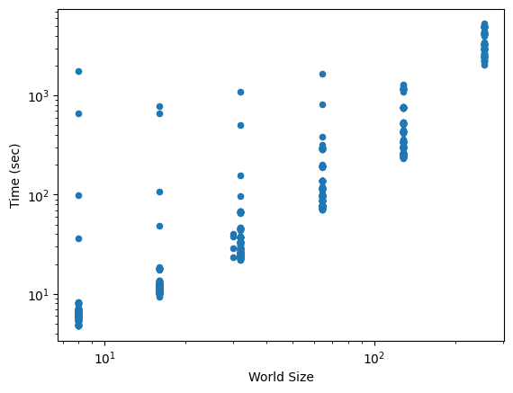
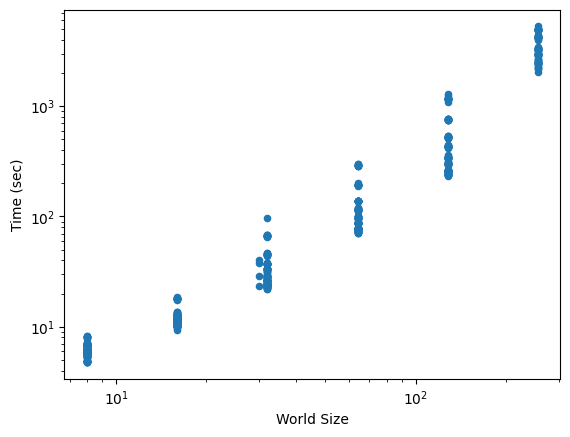

## Data on MuCluster with outliers

# Without Outliers

These are the only good looking plots I managed to generate today, you can check analysis.ipynb for my attempted at other plots.

I have no idea where the crossover points are because apparently I don't know how pandas works.